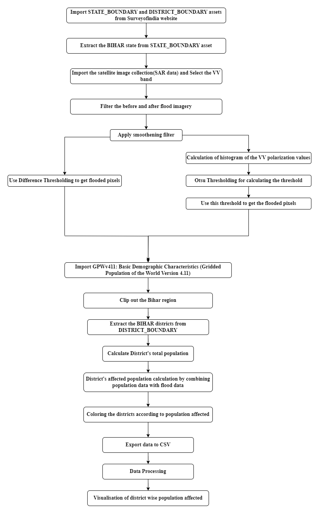
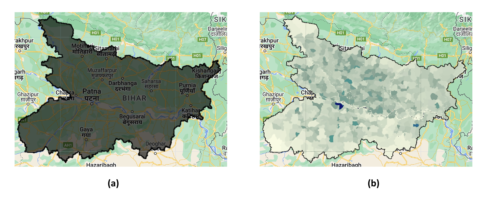
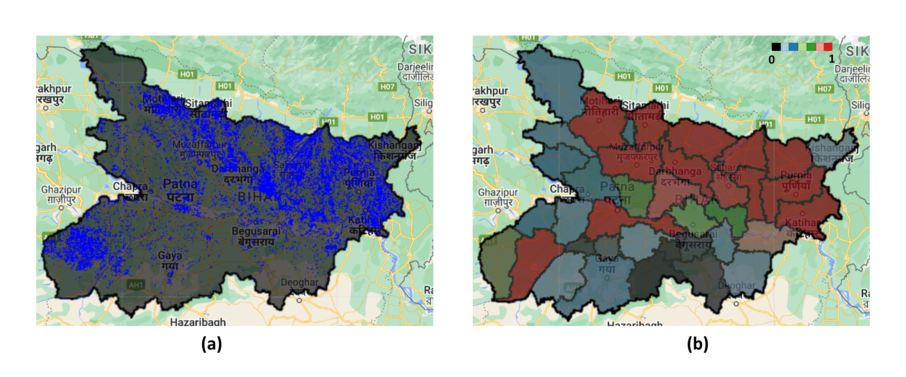

# 🌊 Flood Risk Assessment of Bihar, India using Sentinel-1 and Google Earth Engine

This project leverages **Google Earth Engine (GEE)** and **Sentinel-1 SAR imagery** to detect and analyze flood-affected regions in **Bihar, India**, and evaluates **population exposure** based on demographic data. The workflow involves image preprocessing, Otsu threshold-based flood detection, population impact estimation, and visualization.

---

## 📍 Overview

Floods are a recurring natural hazard in the Indian state of Bihar. This project uses GEE to:
- Detect flood extents using **VV polarization SAR data**
- Apply **Otsu thresholding** to separate water from land
- Quantify **flood impact** on population using gridded census data
- Visualize flood zones and exposed population by district

---

## 🔗 Live Project

[🌐 Launch the Earth Engine Script](https://code.earthengine.google.com/5dee56c5f462c0429be1c5eb1c7ac2a2)

---

## 🛰️ Data Sources

| Dataset | Description |
|--------|-------------|
| [Sentinel-1 SAR (VV)](https://developers.google.com/earth-engine/datasets/catalog/COPERNICUS_S1_GRD) | Radar imagery (cloud-penetrating) used for flood detection |
| [GPWv4 Population](https://developers.google.com/earth-engine/datasets/catalog/CIESIN_GPWv411_GPW_Basic_Demographic_Characteristics) | Gridded population data for exposure analysis |
| [Bihar State Boundary & Districts](https://onlinemaps.surveyofindia.gov.in/) | Vector shapefiles used for spatial filtering and regional stats |

---

## ⚙️ Methodology

### 1. 🗺️ Study Area Definition
- Filter administrative boundaries to extract **Bihar**
- Clip all images to this boundary

### 2. 🛰️ Sentinel-1 Preprocessing
- Filter Sentinel-1 **VV-polarized GRD** images
- Mosaic and clip images **before and after flood period**
- Apply **median filter (speckle noise reduction)**

### 3. 📊 Otsu Thresholding
- Compute histogram of difference image
- Apply **Otsu’s method** to compute optimal water/non-water threshold
- Generate binary **flood mask**

### 4. 👥 Population Exposure
- Multiply flood extent mask with **population raster**
- Compute:
  - **Total district-wise population**
  - **Flood-affected population**
- Visualize using color-coded district maps

### 5. 📤 Export
- District-wise affected population statistics exported as CSV

---

## 📌 Outputs

- **Flood Extent Map**
- **Population Density Map**
- **Flood-Affected Districts Overlay**
- **District-wise Affected Population Table (CSV)**

---

## 📄 Citation

If you use this project or dataset, please cite our publication:

> R. R. Pandey, D. P. Singh, J. Choudhary and N. Nigam,  
> *"Flood Risk Assessment of Bihar State of India using Sentinel-1 on Google Earth Engine,"*  
> 2025 IEEE International Students' Conference on Electrical, Electronics and Computer Science (SCEECS), Bhopal, India, 2025, pp. 1–5.  
> DOI: [10.1109/SCEECS64059.2025.10941246](https://doi.org/10.1109/SCEECS64059.2025.10941246)

---

## 📊 Sample Visuals

---

## 📌 Keywords

`Earth Engine` · `Flood Detection` · `Sentinel-1` · `VV Polarization` · `Otsu Thresholding`  
`Remote Sensing` · `Disaster Risk` · `Bihar` · `Population Exposure`
